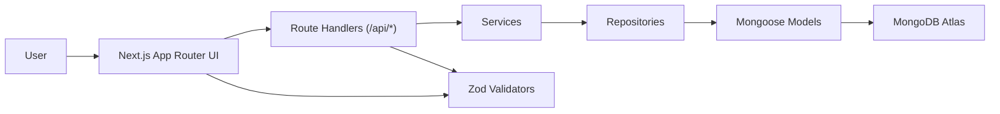
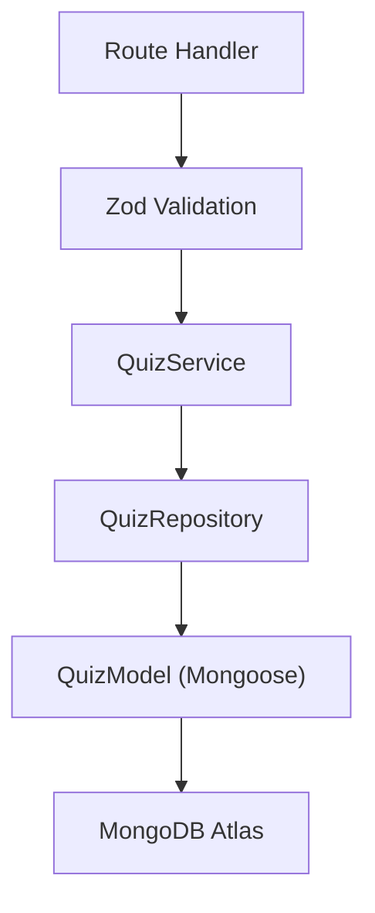
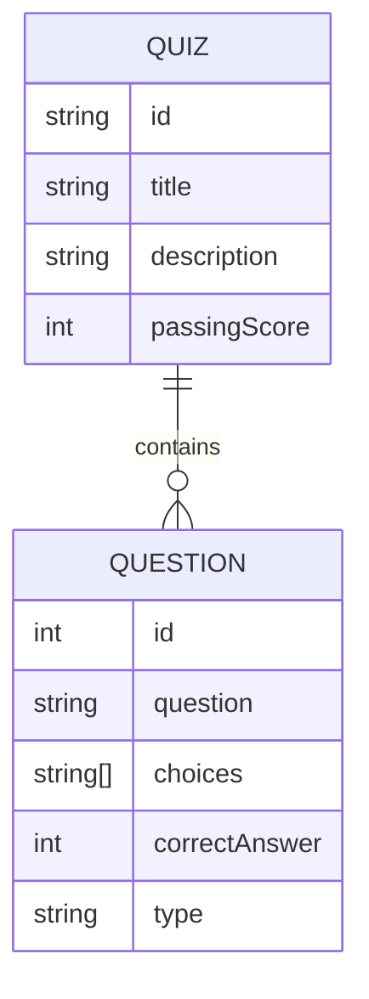

## 1. Architecture Design



Key decisions:
- Next.js 15 App Router provides server components for data fetching and route handlers for the API.
- MongoDB Atlas stores quiz documents in the exact JSON structure required by the product.
- Mongoose models represent persisted documents; Zod provides runtime validation for both persisted data and client submissions.
- Clean architecture separation: UI → feature modules → services → repositories → models.

## 2. Technology Description
- Frontend: Next.js 15 (App Router) + React 19 + TypeScript + Tailwind CSS + Framer Motion
- Backend (within Next.js): Route Handlers under `src/app/api/*`
- Database: MongoDB Atlas
- ODM: Mongoose
- Validation: Zod
- Testing: Vitest + React Testing Library
- Package manager: pnpm

## 3. Route Definitions
| Route | Purpose |
|-------|---------|
| / | Landing page marketing + featured quizzes |
| /quizzes | Quiz list page, renders quizzes from MongoDB |
| /quiz/[quizId] | Quiz welcome page |
| /quiz/[quizId]/play | Quiz taking experience |
| /quiz/[quizId]/results | Results page |
| /api/quizzes | GET all quizzes |
| /api/quizzes/[id] | GET quiz by id |
| /api/quizzes/[id]/submit | POST answers to compute score/pass-fail |

## 4. API Definitions

### 4.1 GET /api/quizzes
Response:
```ts
type QuizListItem = {
  id: string
  title: string
  description: string
  passingScore: number
  questionsCount: number
}
```

### 4.2 GET /api/quizzes/[id]
Response: Quiz document shape stored in MongoDB (same as required JSON structure).

### 4.3 POST /api/quizzes/[id]/submit
Request:
```ts
type Submission = {
  answers: Array<
    | { questionId: number; type: "multiple_choice"; answerIndex: number }
    | { questionId: number; type: "true_false"; answerBoolean: boolean }
    | { questionId: number; type: "free_text"; answerText: string }
  >
}
```

Response:
```json
{
  "score": 8,
  "percentage": 80,
  "passed": true
}
```

## 5. Server Architecture Diagram



## 6. Data Model

### 6.1 Data Model Definition



Notes:
- The persisted document stores `questions` as an array inside the quiz document (MongoDB embedding).
- `correctAnswer` is an index for multiple_choice and true_false; for free_text it can be omitted or set to a canonical string (service handles comparison rules).

### 6.2 Data Definition Language
MongoDB collection:
- `quizzes` collection
- Unique index on `id`

Seed behavior:
- On first server usage, check if `quizzes` collection is empty; if empty, insert sample quizzes (JavaScript Basics, TypeScript Fundamentals, General Knowledge) using the exact JSON structure required.
