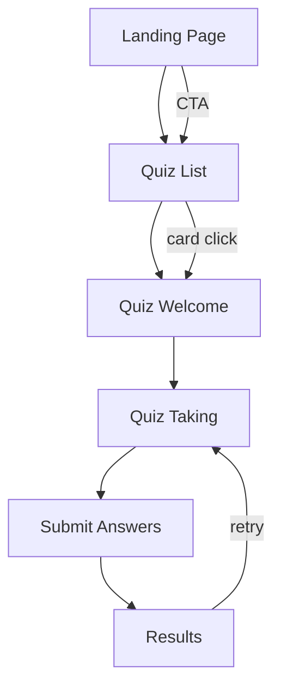

## 1. Product Overview
AI-Assisted Quiz Platform is a modern, JSON-driven quiz experience where all quiz content lives in MongoDB and the UI renders quizzes dynamically.
- Helps learners practice and self-assess quickly with smooth motion, clear progress feedback, and friendly results.
- Enables hackathon-ready extensibility: new quizzes can be added by inserting JSON documents without changing frontend code.

## 2. Core Features

### 2.1 User Roles (if applicable)
Not required for hackathon scope. The product is usable without accounts.

### 2.2 Feature Module
1. **Landing page**: hero + CTA, featured quizzes, how it works, benefits, light marketing visuals, clear navigation.
2. **Quiz list page**: fetch and display all quizzes from MongoDB with card-based browsing and quick metadata.
3. **Quiz welcome page**: quiz details (markdown description), optional image, passing score, question count, start action.
4. **Quiz taking page**: dynamic question rendering by type (multiple_choice, true_false, free_text), progress, transitions.
5. **Results page**: computed score/percentage/pass-fail, animated state, breakdown, retry.
6. **API layer**: JSON-driven quiz retrieval + submission scoring endpoint with validation.
7. **Data seeding**: auto-seed sample quizzes on first app start when the collection is empty.
8. **Reliability UX**: skeleton loading, empty states, not-found states, invalid submission states, friendly error UI.

### 2.3 Page Details
| Page Name | Module Name | Feature description |
|-----------|-------------|---------------------|
| Landing (/) | Top navigation | Sticky header, brand mark, link to quizzes, CTA button |
| Landing (/) | Hero | Strong headline, short value props, primary CTA to /quizzes |
| Landing (/) | Featured quizzes | 3 featured quizzes, fetched from API, hover motion, quick start links |
| Landing (/) | How it works | 3-step explanation: choose quiz → answer → see results |
| Landing (/) | Benefits | Professional SaaS-style benefits grid with icons |
| Quizzes (/quizzes) | Quiz grid | List all quizzes from DB; each card shows title, description, question count, passing score |
| Quizzes (/quizzes) | Loading/empty | Skeleton cards while loading; empty state if no quizzes |
| Quiz welcome (/quiz/[quizId]) | Quiz meta | Title, optional image, markdown description, passing score, question count |
| Quiz welcome (/quiz/[quizId]) | Start action | “Start quiz” button navigates to /quiz/[quizId]/play |
| Quiz play (/quiz/[quizId]/play) | Progress | Progress bar + question counter + animated transitions |
| Quiz play (/quiz/[quizId]/play) | Question renderer | Reusable renderer that maps question.type to the correct UI component; no hardcoded questions |
| Quiz play (/quiz/[quizId]/play) | Submission | Collect answers, validate payload, submit to API, navigate to results |
| Results (/quiz/[quizId]/results) | Summary | Score, percentage, pass/fail, total correct/wrong |
| Results (/quiz/[quizId]/results) | Motion state | Animated success/failure, progress ring/number animation |
| Results (/quiz/[quizId]/results) | Retry | “Retry quiz” returns to /quiz/[quizId]/play and resets state |

## 3. Core Process
Primary user flow: discover quiz → review details → take quiz → submit → see results → optionally retry.

## 4. User Interface Design

### 4.1 Design Style
- Theme colors:
  - Primary Blue: #0F4C81
  - Secondary Blue: #2F80ED
  - Light Blue: #EAF4FF
  - White: #FFFFFF
  - Dark Text: #1E293B
- Visual style: modern SaaS, rounded cards, clean typography, playful learning vibe, accessible contrasts.
- Motion: Framer Motion for page transitions, card hovers, quiz question transitions, progress animations, result animations.
- Illustration/icon style: minimal line icons with soft fills, simple geometric shapes, subtle background patterns.
- Layout: grid-based cards, generous spacing, strong hierarchy, mobile-first responsiveness.

### 4.2 Page Design Overview
| Page Name | Module Name | UI Elements |
|-----------|-------------|-------------|
| Landing | Hero | Large headline, supporting copy, CTA button, illustration block, subtle animated background |
| Landing | Featured quizzes | 3 cards, hover lift + shadow bloom, “Start” micro-action |
| Landing | How it works | Step cards with icons, staggered reveal on scroll |
| Landing | Benefits | 2–3 column grid, concise copy, consistent icons |
| Quizzes | Quiz cards | Title + 2-line description, chips for passing score and question count, CTA arrow |
| Quiz welcome | Detail card | Markdown description, meta chips, optional image, start button |
| Quiz play | Question card | Question title, choices area that adapts by type, primary/secondary actions, keyboard friendly focus |
| Quiz play | Progress | Top progress bar + numeric counter, animated fill |
| Results | Outcome | Big percentage, pass/fail badge, breakdown stats, retry button, animated confetti-like shapes (non-distracting) |

### 4.3 Responsiveness
- Mobile-first layouts with stacked sections, sticky bottom action area on quiz play where helpful.
- Tap targets ≥ 44px, visible focus states, reduced motion support via prefers-reduced-motion.
- Cards shift from 3-column (desktop) → 2-column (tablet) → 1-column (mobile).
